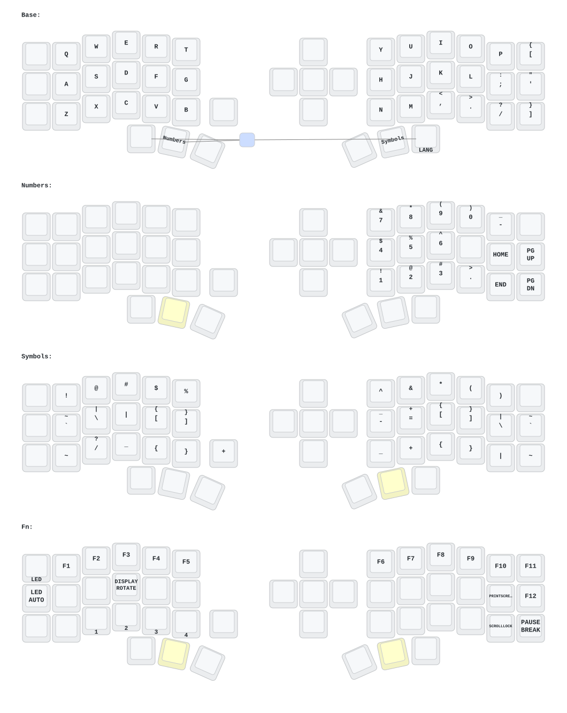

# Eyelash Corne — ZMK Firmware

Firmware for the [Eyelash Peripherals Corne](https://github.com/goncharov-vladimir/zmk-new_corne) split keyboard with a dongle setup.

> ⚠️ This keyboard is **not** compatible with foostan's Corne (`crbd`) firmware.

## Architecture

| Device | Board | Role | Display |
|--------|-------|---------|---------|
| Dongle | `nice_nano_v2` | Central | OLED (dongle_display) |
| Left half | `eyelash_corne_left` | Peripheral | nice!view |
| Right half | `eyelash_corne_right` | Peripheral | nice!view |

## Build

### GitHub Actions (recommended)

1. Fork this repo
2. Enable **Actions** workflow
3. Push changes to `config/`
4. Download `.uf2` artifacts from the build

### Local build

```bash
# First time only — install west + ARM toolchain, then:
make init        # download ZMK + modules + apply patches

# Build (any time after editing config)
make build       # all variants
make build-left  # left half only
make build-dongle # dongle only
# ...see make help
```

**Prerequisites:** `west` (`pip install west`), ARM GCC toolchain (`brew install --cask gcc-arm-embedded`)

## Flash

Flash order: **settings_reset → dongle → left → right**

1. Double-tap reset → `NICENANO` drive appears
2. Copy the `.uf2` file to the drive
3. Device reboots automatically

| File | Target |
|------|--------|
| `settings_reset.uf2` | All 3 controllers (one by one) |
| `nice_nano_v2_dongle.uf2` | Dongle |
| `eyelash_corne_left.uf2` | Left half |
| `eyelash_corne_right.uf2` | Right half |

## Keymap



Edit `config/eyelash_corne.keymap`, then rebuild.

## Configuration

| File | Purpose |
|------|---------|
| `config/eyelash_corne.keymap` | Keymap (4 layers: Base, Numbers, Symbols, Fn) |
| `config/eyelash_corne.conf` | Kconfig for keyboard halves |
| `config/eyelash_corne_dongle.conf` | Kconfig for dongle |
| `config/eyelash_corne_dongle.keymap` | Dongle keymap (includes main keymap) |
| `config/west.yml` | West manifest (ZMK v0.3.0 + modules) |
| `config/boards/` | Board & shield definitions (auto-discovered) |

## Clean

```bash
make clean      # remove build/ artifacts
make pristine   # full reset (removes zmk/, modules/, .west/ etc.)
# After pristine, run: make init   # this also applies required patches
```

## Keymap Drawing

Push to `config/` triggers the `draw` workflow — keymap SVG is auto-generated by [Keymap Drawer](https://github.com/caksoylar/keymap-drawer).